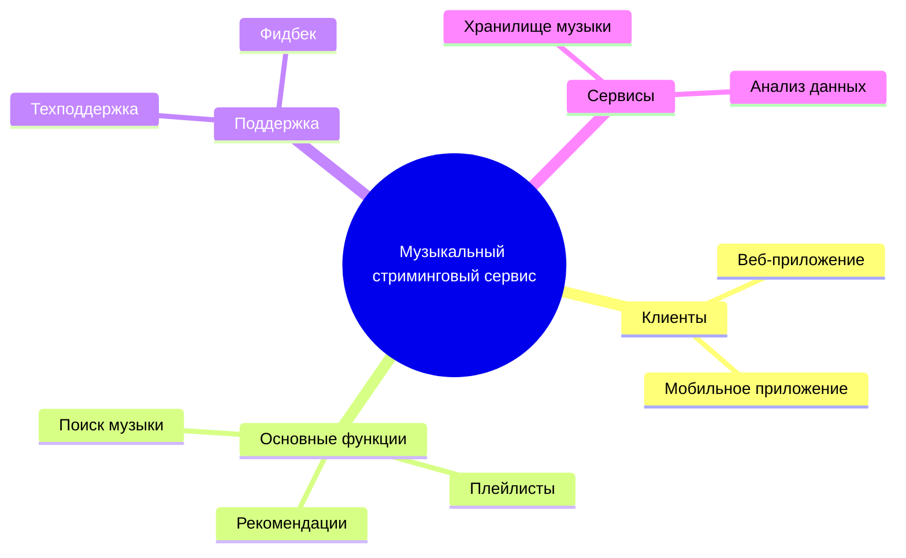
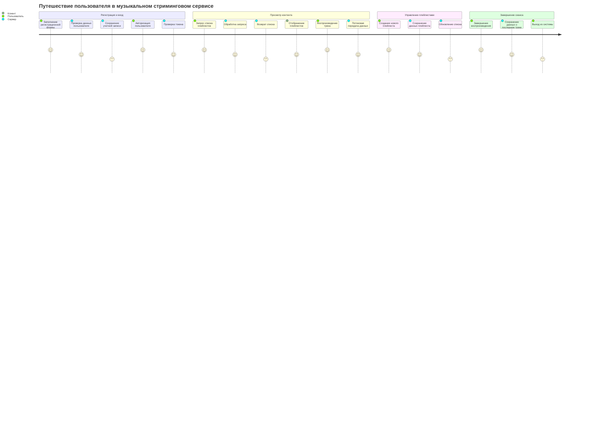
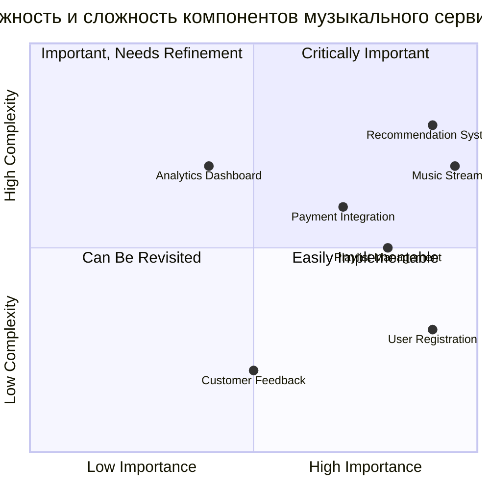
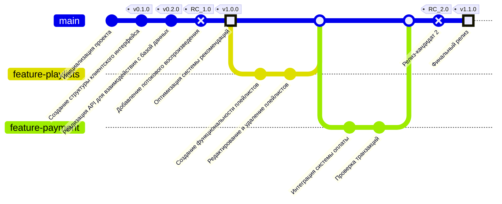

# Музыкальный стриминговый сервис

Этот проект представляет клиент-серверную систему, включая взаимодействие между клиентом, API и сервером.
## Содержание

1. [Структура функциональных возможностей (Mind Map)](#структура-функциональных-возможностей-mind-map)
2. [Диаграмма путешествия пользователя (User Journey Diagram)](#диаграмма-путешествия-пользователя-user-journey-diagram)
3. [Квадрант-граф (Quadrant Chart)](#квадрант-граф-quadrant-chart)
4. [Гит граф (Git Graph)](#гит-граф-git-graph)

---

## Структура функциональных возможностей (Mind Map)

### Пояснение диаграммы
Эта диаграмма в формате mind map отображает общую структуру системы, разделяя ее на три основных аспекта: клиенты, основные функции, поддержка и сервисы.

1. Клиентская часть:

  Пользователь взаимодействует с системой через веб-приложение и мобильное приложение
  
2. В качестве основных функций выделены следующие разделы:
  * Плейлисты:
      + Управление плейлистами.
      + Возможность поделиться плейлисом.
  * Рекомендации:
      + Хранит структурированные данные о предпочениях пользователя.
  * Поиск музыки:
      + Служит лоя поиска музыки.
3. Поддержка:
  * Указаны способы обратной связи и решения пользовательских проблем (техподдержка и фидбек).
4. Сервисы:
  * Включают хранилище музыки и аналитику для анализа пользовательского поведения и оптимизации работы системы.

Эта диаграмма помогает понять ключевые функциональные элементы системы и их распределение, определяя зоны ответственности каждого компонента.

---

## Диаграмма путешествия пользователя (User Journey Diagram)

### Пояснение диаграммы
Диаграмма User Journey отображает пошаговый процесс взаимодействия пользователя с клиент-серверной системой. Она разбита на несколько логических этапов:

1. Регистрация и вход:

Пользователь регистрируется, сервер проверяет и сохраняет данные. Авторизация осуществляется через проверку токена для дальнейшего взаимодействия.

2. Просмотр контента:

Пользователь запрашивает плейлисты, сервер обрабатывает запрос и возвращает список, отображаемый на клиенте. Также реализовано воспроизведение треков с потоковой передачей данных.

3. Управление плейлистами:

Пользователь создает и редактирует плейлисты, изменения сохраняются на сервере, после чего список обновляется на клиентской стороне.

4. Завершение сеанса:

В конце сессии сервер фиксирует последние действия пользователя, такие как воспроизведение треков, и сохраняет прогресс.

Эта диаграмма помогает понять, как пользователь взаимодействует с системой на разных этапах, и отображает, какие действия выполняются сервером и клиентом. Она фокусируется на том, как данные проходят через систему, что важно для проектирования эффективной архитектуры.

---

## Квадрант-граф (Quadrant Chart)

### Пояснение диаграммы
Квадрант-граф оценивает ключевые компоненты системы по двум критериям: важность и сложность. Это помогает определить приоритеты в разработке и планировании ресурсов.

1. Квадрант 1 (Критически важные):

Высокая важность и сложность. Например, потоковая передача музыки и система рекомендаций требуют значительных ресурсов для реализации.

2. Квадрант 2 (Важные, требующие доработки):

Важные компоненты, которые можно доработать после базовых функций, такие как интеграция платежей.

3. Квадрант 3 (Могут быть пересмотрены):

Компоненты средней важности, например, аналитическая панель, могут быть оптимизированы на более поздних этапах разработки.

4. Квадрант 4 (Легко реализуемые):

Компоненты с низкой сложностью, например, регистрация и авторизация пользователей, могут быть быстро реализованы на ранних этапах.

Этот граф помогает расставить приоритеты и определить стратегию разработки системы, начиная с наиболее важных и сложных задач.

---

## Гит граф (Git Graph)

### Пояснение диаграммы
Гит-граф отображает процесс разработки системы с точки зрения управления версиями и этапов реализации. Каждое изменение в коде представлено коммитами, сгруппированными по этапам и помеченными тегами для обозначения значимых версий и релизов.

Этапы разработки:
1. Инициализация проекта:

  * Создание базовой структуры репозитория, включая настройки окружения, инициализацию файлов README.md и .gitignore. Подготовка проекта к дальнейшей разработке.
2. Создание структуры клиентского интерфейса (v0.1.0):

  * Разработан базовый интерфейс пользователя, включающий страницы регистрации, входа и домашнюю страницу. Добавлены основные компоненты UI, такие как кнопки, формы и меню навигации.
3. Реализация API для взаимодействия с базой данных (v0.2.0):

  * Созданы базовые эндпоинты API для управления данными, включая регистрацию пользователей, авторизацию и получение плейлистов. Настроено соединение с базой данных.
4. Добавление потокового воспроизведения (RC_1.0):

  * Реализована функциональность потоковой передачи аудио. Пользователи могут воспроизводить треки в реальном времени. Настроено кеширование и оптимизация скорости передачи данных.
5. Оптимизация системы рекомендаций (v1.0.0):

  * Улучшен алгоритм рекомендаций на основе пользовательских предпочтений. Добавлены методы анализа данных, такие как обработка истории прослушиваний и оценок треков.
6. Создание функциональности плейлистов:

  * В ветке feature-playlists реализовано создание пользовательских плейлистов. Пользователи могут добавлять треки, называть плейлисты и просматривать их.
7. Редактирование и удаление плейлистов:

  * Добавлены функции редактирования названия плейлистов и удаления отдельных плейлистов. Изменения синхронизируются с сервером в реальном времени.
8. Интеграция системы оплаты:

  * В ветке feature-payment внедрена интеграция с платежным шлюзом. Пользователи могут осуществлять покупки подписок через сторонние платежные сервисы.
9. Проверка транзакций:

  * Реализована логика проверки транзакций, включая подтверждение успешной оплаты и обработку ошибок. Данные сохраняются в базе для последующего анализа.
10. Релиз-кандидат 2 (RC_2.0):

  * Вторая тестовая версия включает полный набор функций, готовых к проверке. Включены исправления ошибок, тестирование на стабильность и доработки интерфейса.
11. Финальный релиз (v1.1.0):

  * Выпущена окончательная версия системы. Включены последние оптимизации производительности, финальная доработка пользовательского интерфейса и документирование кода.

Теги версий отражают завершение ключевых этапов, что позволяет отслеживать прогресс и вносить изменения на основе обратной связи.
Гит-граф помогает структурировать процесс разработки, разбивая его на логические части, и служит отличным инструментом для документации, особенно при командной работе.
